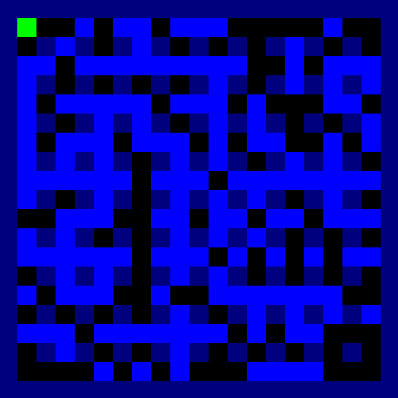

I kind of wanted to make a game with high contrasts for my new OLED screen. So this project is just me having some fun trying to write some clean object oriented Python code while emulating the classic Bomberman experience. In the future I'd like to introduce some additional features to the game, such as new mechanics, multiplayer, and more elaborate AI.

### 05/12/2022

A quick coding session where I added the ability to draw text on screen, which was necessary to create different items. And for future UI information.
This required a major refactor of my config solution, which went from standard `.cfg` to a Python object. It also required further refactoring  to enable 
passing all config specifications from the config class to the object manager to the individual objects. However, I'm still not satisfied with this current 
solution because I can't just pass the object manager to every function of every object. 

Next up is to add the interactions with the new items. And, as you might be able to see in the example, I also need to add a render priority attribute to my objects.
Explosions should always be rendered on top of items. After that I might work on some UI stuff.

See [here](blog.md) for old blog entries.