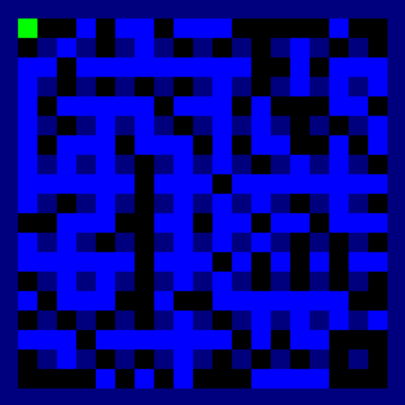

This project is just me having some fun trying to write some clean object oriented Python code while emulating the classic Bomberman experience. In the future I'd like to introduce some additional features to the game, such as new mechanics, multiplayer, and more elaborate AI.

### 06/11/2022

This weekend marks the start of this project. Everything has been coming along just fine. The object management only took a reasonable amount of debugging and seems to scale well now.
I've got the core loop going including player movement and object interactions. I'll probably refactor my code next, introduce some inheritance to my objects...

See [here](blog.md) for old blog entries.